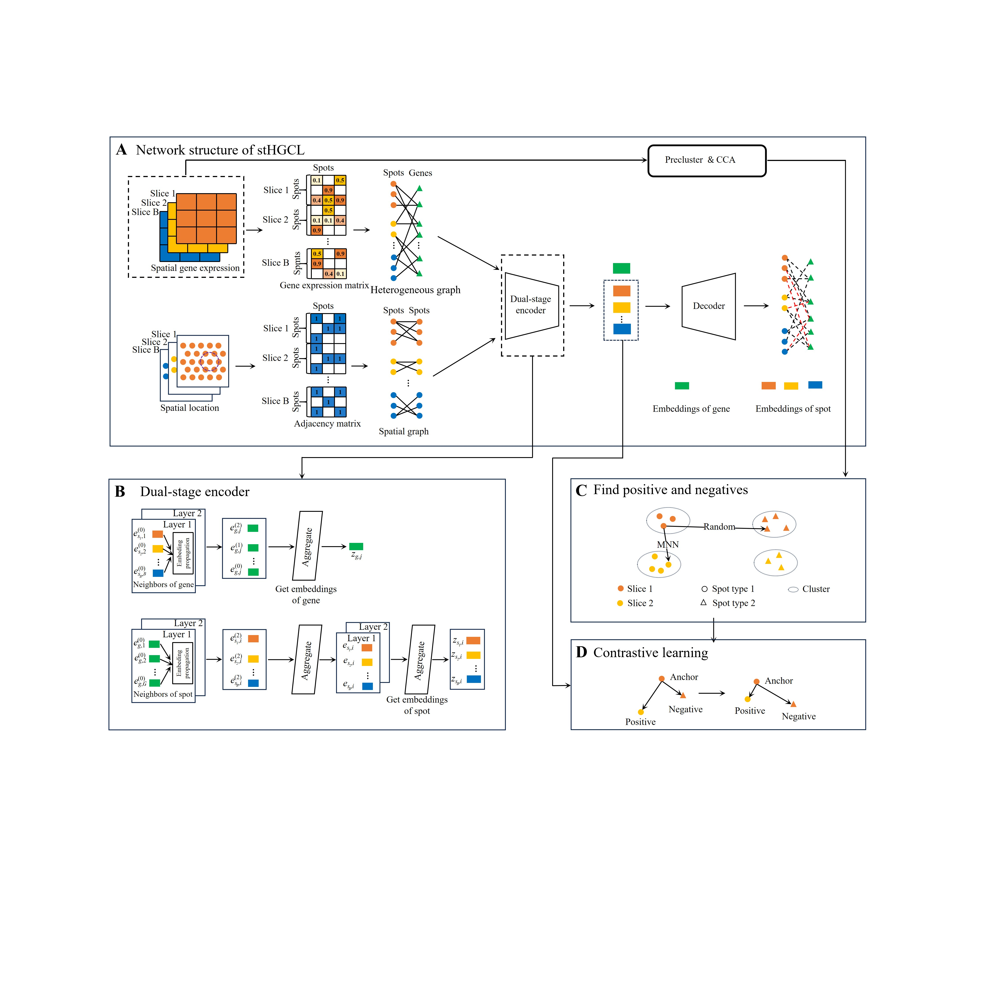

# Leveraging spot-gene heterogeneous graphs for unified spatial transcriptomics domain detection on single-slice and multi-slice data
## 1. Overview

We propose stHGCL, a novel spot-gene heterogeneous graph method for unified domain detection on single-slice and multi-slice data. It connects spots to shared expressed genes, capturing high-order structural information and indirect inter-slice links. A contrastive learning module constrains spot embeddings via neighborhood relationships, eliminating batch effects and ensuring intra-cluster compactness. With remarkable consistency, stHGCL outperforms nine single-slice and eight multi-slice methods across a diverse range of tissue types, thereby enabling the precise identification of sophisticated biological domains.




## 2. Quick Start

Start by grabbing this source codes:

```bash
# Clone the repository
git clone https://github.com/Xia-xia-li/stHGCL.git
cd stHGCL
```

## 3. Virtual environment

```
conda create -n stHGCL_env python=3.9
conda activate stHGCL_env
pip install -r stHGCL_requirement.txt
```
## Contact

For any questions or issues, please open an issue on GitHub or contact [xln@cug.edu.cn]. 
